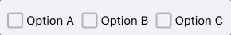
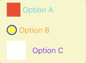
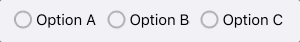

# RadioAndCheckboxButton
[RadioButton](Source/RadioButton/RadioButton.swift) and [CheckboxButton](Source/CheckboxButton/CheckboxButton.swift) are subclass of UIButton control. Use can use RadioButton and CheckboxButton same as UIButton. It gives you animation and different styles of a button. You can group buttons to take advantage of more feature. It automatically manages all selections/deselection of RadioButton and CheckboxButton.

### CheckboxButton
###### Default Style

###### Customized Style


### RadioButton
###### Default Style

###### Customized Style


## Installation

### CocoaPods

[CocoaPods](http://cocoapods.org) is a dependency manager for Cocoa projects. You can install it with the following command:

```bash
$ gem install cocoapods
```

To integrate ***RadioButton and CheckboxButton*** into your Xcode project using CocoaPods, specify it in your `Podfile`:

```ruby
target '<Your Target Name>' do
    pod 'MBRadioCheckboxButton'
end
```

You can integrate indivisual button control if required.

```ruby
target '<Your Target Name>' do
    pod 'MBRadioButton'
end
```
```ruby
target '<Your Target Name>' do
    pod 'MBCheckboxButton'
end
```

Then, run the following command:

```bash
$ pod install
```

## How to Use
It is simple and easy to use. Just assign [RadioButton](Source/RadioButton/RadioButton.swift) or [CheckboxButton](Source/CheckboxButton/CheckboxButton.swift) to your button in XIB. You can advantage of grouping button using [RadioButtonContainerView] (Source/RadioButton/RadioButtonContainerView.swift) or [CheckboxButtonContainerView](Source/CheckboxButton/CheckboxButtonContainerView.swift). Add all the button in a UIView and assign respective container classes to view For more details please refer to [RadioAndCheckboxButtonDemo](./) example. It has **CheckboxButtonDelegate** and **RadioButtonDelegate** to get a callback of selection and deselection of a button.

## Customization
For more customization please refer to [RadioAndCheckboxButtonDemo](./) example.

## Licence

**[MIT](LICENSE)**
